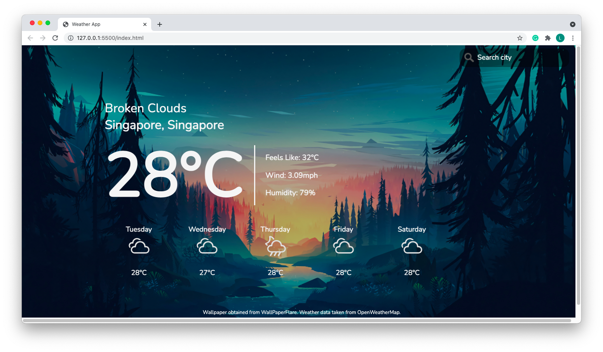

# weather
## Introduction
weather is a weather forecast web application created as part of TheOdinProject syallabus, as practice for Promises and API calling.
This project is created using HTML, CSS and Vanilla Javascript.
Data displayed in the web application is taken from OpenWeatherMap API.

## Using the Application
### Via GitHub Pages
The web application is hosted on GitHub pages at the following link: https://boonhaii.github.io/weather/.
The default city displayed is Singapore, Singapore, with the detailed weather report for today, as well as the forecast for the upcoming 5 days.
A sample of the display is as follows:

To search for a specific country, use the search bar on the top right hand corner. The detailed data for today and weather forecast should be updated.
Do take note to search for cities rather than countries for the best experience, as certain data fetched may not be accurate. 
(Eg. searching for China returns a city in Mexico, named China)

### Via Local Computer
The web application can also be ran locally on your device. To do so, clone the repo and open the index.html file with your web browser. The steps to use
the web application is the same as if accessed via GitHub pages.

## Closing Remarks
The following are the current ideas on future features for implementation:
1. Increase responsive design for various medium used to view the web page.
2. Implement section to indicate the legends of the forecast logos.
3. Display the local current time.

Thank you for checking out my project!
